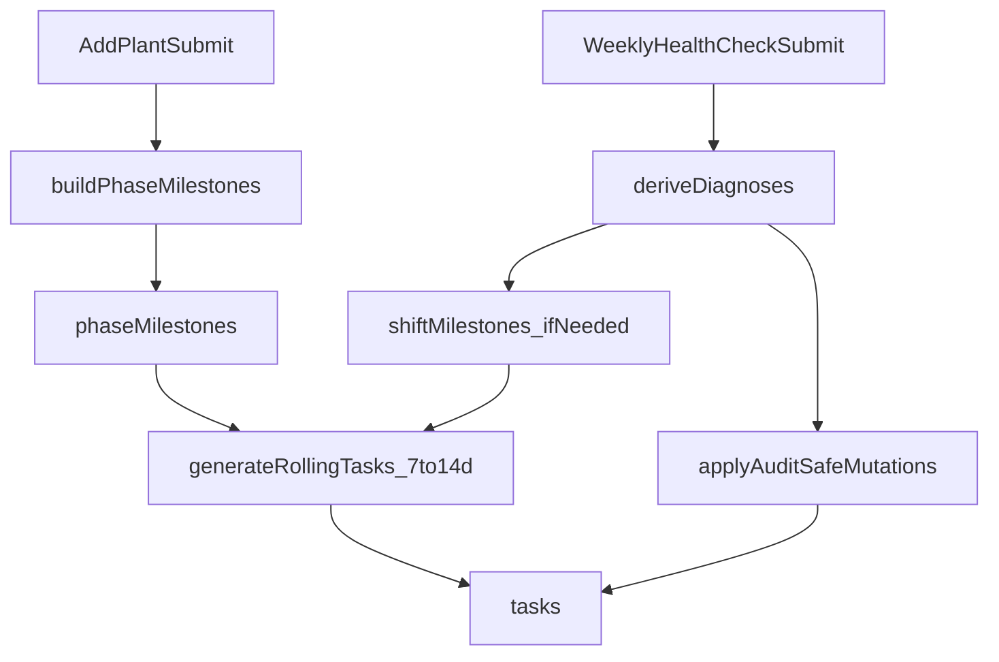

# TaskEngine + HealthCheck Core Plan

Rules applied: existing-patterns-first, InstantDB-hook-pattern, i18n-required, TS-typed-domain, audit-safe-mutations.

## Current Anchors (reuse, do not replace)

- Plant creation + starter tasks: [src/hooks/use-plants.ts](src/hooks/use-plants.ts)
- Task CRUD/query pattern: [src/hooks/use-tasks.ts](src/hooks/use-tasks.ts)
- DB schema + links: [instant.schema.ts](instant.schema.ts), [instant.perms.ts](instant.perms.ts), [src/lib/instant.ts](src/lib/instant.ts)
- Add-plant inputs already available for engine: [src/lib/forms/schemas.ts](src/lib/forms/schemas.ts), [src/screens/add-plant-screen.tsx](src/screens/add-plant-screen.tsx)

## Proposed Data Model

### 1) Task (domain schema)

```ts
export type TaskType =
  | 'water'
  | 'feed'
  | 'environment-check'
  | 'ph-check'
  | 'cycle-switch'
  | 'weather-protection'
  | 'pest-check'
  | 'sativa-stretch-warning'
  | 'recovery-dryout'
  | 'flush-water-only'
  | 'health-warning';

export type TaskStatus = 'planned' | 'completed' | 'cancelled' | 'superseded';

export type TaskMetadata = {
  phase?: 'seedling' | 'vegetative' | 'flowering' | 'harvest';
  source: 'generator' | 'mutator' | 'manual';
  reasonCode?:
    | 'overwatering'
    | 'underwatering'
    | 'nitrogen-deficiency'
    | 'nutrient-burn'
    | 'stunted-growth'
    | 'sativa-prep';
  dosageAdjustmentPct?: number;
  actionGroupId?: string; // ties superseded + replacement tasks
  healthCheckId?: string;
};
```

### 2) InstantDB entities/fields

- Extend `tasks` in [instant.schema.ts](instant.schema.ts):
  - `type: string().indexed().optional()`
  - `status: string().indexed().optional()`
  - `dueAt: number().indexed().optional()` (canonical sorting/range)
  - `metadataJson: string().optional()`
  - `supersededByTaskId: string().optional()`
  - `source: string().indexed().optional()`
- Add `phaseMilestones` entity (master plan, low row count):
  - `phase`, `projectedStartDate`, `projectedEndDate`, `isFlexible`, `version`, `createdAt`, `updatedAt`
  - link to `plant`, `owner`
- Add `healthChecks` entity (audit + idempotency):
  - `checkDate`, `weekKey`, `payloadJson`, `diagnosisJson`, `mutationBatchId`, `createdAt`
  - link to `plant`, `owner`

## TaskGenerator Architecture (Phase 1)

### Inputs

`seedType`, `medium`, `potSize`, `environment`, `strainDominance` (+ existing plant fields `startDate`, `reminderTimeLocal`, `sourceType`, `lightSchedulePreset`).

### Mapping rules

- `seedType`:
  - Autoflower => fixed milestone timeline (8-12w projected ranges).
  - Photoperiodic => vegetative milestone flexible; add projected switch window around week 4-6.
- `medium`:
  - Soil => water cadence baseline every 2-4d.
  - Coco/Hydro => daily water/feed + recurring `ph-check`.
- `potSize` => cadence multiplier (small pot increases frequency, large pot decreases).
- `environment`:
  - Indoor => light distance + ventilation + temp/humidity checks.
  - Outdoor => no light tasks; add weather protection + pest checks.
- `strainDominance`:
  - Sativa => schedule pre-flower warning task (`sativa-stretch-warning`).

### Core functions (functional modules, no classes)

- `buildPhaseMilestones(input): PhaseMilestoneDraft[]`
- `computeCadenceProfile(input): CadenceProfile`
- `generateRollingTasks({ plant, milestones, rangeStart, rangeEnd }): TaskDraft[]`
- `ensureRollingWindow({ plantId, daysAhead }): Promise<...>`

## TaskMutator Architecture (Phase 2)

### Weekly HealthCheck decision flow

- Watering issues:
  - drooping + heavy/wet => overwatering
    - supersede upcoming watering tasks in window
    - create immediate `recovery-dryout` task
  - drooping + light/dry => underwatering
    - create immediate `water` task (high priority)
- Nutrient issues:
  - yellowing bottom leaves => nitrogen deficiency
    - supersede next feed, create replacement feed with `dosageAdjustmentPct` increase
  - burnt/crispy tips => nutrient burn
    - supersede next feed, create `flush-water-only`
- Stunted growth:
  - photoperiodic => shift flowering-switch milestone +7..14 days, bump milestone `version`, regenerate rolling window
  - autoflower => add warning task; no cycle delay

### Multi-Diagnosis Priority & Conflict Resolution

When a single health check yields multiple diagnoses, `buildTaskMutationPlan` processes them in **strict severity order**:

1. **Water issues** (overwatering / underwatering) — processed first; supersede/create water tasks immediately.
2. **Nutrient issues** (nutrient-burn / nitrogen-deficiency) — processed second, mutually exclusive (`nutrient-burn` wins via `if/else if`). A `flush-water-only` supersedes the next `feed`; a nitrogen-deficiency creates a boosted `feed` replacement.
3. **Growth issues** (stunted-growth) — processed last; shifts milestones (photoperiod) or adds warning (autoflower). Does not conflict with water/nutrient mutations.

**Conflict rules:**

- If a scheduled task is targeted by multiple diagnosis mutations (e.g., a future `water` task hit by both `recovery-dryout` and a flush), the higher-severity diagnosis's mutation takes precedence.
- Nutrient-burn and nitrogen-deficiency are **mutually exclusive** — burn always wins.
- If a mutation can't find a target task (e.g., no future `feed` exists for a nutrient-burn flush), the diagnosis is recorded as **skipped** rather than silently dropped.

**Audit tracking:**

- `TaskMutationPlan.diagnoses` records all derived diagnoses.
- Add `skippedDiagnoses?: { code: DiagnosisCode; reason: string }[]` to `TaskMutationPlan` to capture diagnoses that couldn't produce mutations (no target task found, superseded by higher-priority diagnosis).
- Add `conflictingDiagnoses?: DiagnosisCode[]` to flag when multiple diagnoses competed for the same target task.
- The `healthChecks` entity `diagnosisJson` stores the full diagnosis list + conflict metadata for audit replay.

### Audit-safe mutation contract

- Never hard-delete generated tasks.
- Mark original task `status='superseded'` with `supersededByTaskId` and shared `actionGroupId`.
- Replacement tasks carry `source='mutator'`, `healthCheckId`, `reasonCode` in metadata.



## File-by-File Implementation Steps

1. **Schema + type foundations**

- Update [instant.schema.ts](instant.schema.ts) with `tasks` extensions + new `phaseMilestones`/`healthChecks` entities.
- Update [src/lib/instant.ts](src/lib/instant.ts) exports for new entities.
- Add domain types in `src/lib/task-engine/types.ts`.

1. **Engine modules (pure logic)**

- Add `src/lib/task-engine/task-generator.ts` (milestone planner + rolling generator).
- Add `src/lib/task-engine/task-mutator.ts` (diagnosis map + mutation actions).
- Add `src/lib/task-engine/task-engine.ts` orchestrator (`initializePlan`, `ensureRollingWindow`, `applyWeeklyHealthCheck`).

1. **Plant creation integration**

- Refactor [src/hooks/use-plants.ts](src/hooks/use-plants.ts): replace inline starter-task array with `TaskEngine.initializePlan(...)`.
- Preserve existing transaction pattern and owner/plant linking.

1. **Task data access integration**

- Extend [src/hooks/use-tasks.ts](src/hooks/use-tasks.ts) to support status-aware queries and helper ops (`supersedeTask`, `createReplacementTask`, `upsertRollingWindow`).

1. **Weekly HealthCheck contract + hook**

- Add Zod schema + TS type in [src/lib/forms/schemas.ts](src/lib/forms/schemas.ts) for questionnaire payload.
- Add `src/hooks/use-weekly-health-check.ts` to persist check and invoke mutator atomically.

1. **UI integration points**

- Add a weekly-check entry route and screen (recommended: `app/plants/[id]/health-check.tsx`, `src/screens/weekly-health-check-screen.tsx`).
- Add CTA from plant detail actions in [src/components/plant-detail/bottom-action-bar.tsx](src/components/plant-detail/bottom-action-bar.tsx) and [src/screens/plant-detail-screen.tsx](src/screens/plant-detail-screen.tsx).
- Add EN/DE strings in [src/lib/i18n/locales/en/garden.ts](src/lib/i18n/locales/en/garden.ts), [src/lib/i18n/locales/de/garden.ts](src/lib/i18n/locales/de/garden.ts) (and a dedicated namespace if desired).

1. **Rolling window refresh strategy**

- Trigger `ensureRollingWindow(14)` on plant detail/schedule focus and after health-check mutation.
- Keep generation idempotent by using deterministic dedupe key (`plantId + type + dueAt + source`).

1. **Observability + safeguards**

- Add metrics for `health_check_submitted`, `mutations_applied`, `milestone_shifted` in [src/lib/observability/sentry-metrics.ts](src/lib/observability/sentry-metrics.ts).
- Validate all questionnaire enums with Zod and bound numeric shifts to prevent malformed payload mutations.

## Core Risks and Mitigations

- Backward compatibility with current UI relying on `completed`: keep `completed` in sync with new `status` during migration.
- Metadata integrity (`metadataJson`): parse with safe guard + schema validation before use.
- Duplicate task generation: enforce dedupe key + transactional upsert behavior.
- Security: mutation pipeline must only query/mutate tasks by `owner.id` + `plant.id` scope and never by raw client-provided task ids alone.

## Local Verification Plan (post-implementation)

- `bunx tsc --noEmit`
- `bun run lint`
- `bun run expo start --clear`
- Manual checks:
  - add photoperiod plant + verify projected switch milestone + rolling 14d tasks
  - submit overwatering check + verify supersede + dry-out replacement
  - submit stunted-growth photoperiod check + verify milestone shift + regenerated rolling tasks
  - submit stunted-growth autoflower check + verify warning task only
